# Introduction to SamvadQL

Welcome to **SamvadQL**, an open-source Text-to-SQL conversational interface that enables users to translate natural language queries into precise and executable SQL commands.

## What is SamvadQL?

SamvadQL provides an intuitive, AI-driven experience for data access and interaction. It bridges the gap between natural language and SQL, making database querying accessible to users regardless of their SQL expertise.

## Key Features

### 🤖 Natural Language Processing

Convert natural language questions into SQL queries using advanced Large Language Models (LLMs).

### ⚡ Real-time Streaming

Progressive query generation with live explanations as the AI processes your request.

### 🎯 Intelligent Schema Selection

Automatic table and column recommendation using vector search technology.

### 🗄️ Multi-Database Support

Works with PostgreSQL, MySQL, Snowflake, and BigQuery out of the box.

### ✅ SQL Validation

Comprehensive syntax validation and safety checks before query execution.

### 🚀 Query Optimization

Performance suggestions and optimization recommendations for better query performance.

### 🔄 Interactive Refinement

Edit and refine generated queries conversationally with the AI assistant.

### 📊 Audit & Compliance

Complete audit logging and governance features for enterprise use.

## Architecture Overview

```mermaid
graph TB
    A[User Input] --> B[Frontend - Next.js]
    B --> C[WebSocket Connection]
    C --> D[Backend - FastAPI]
    D --> E[LLM Service]
    D --> F[Vector Database]
    D --> G[SQL Validation]
    D --> H[Database Connectors]
    H --> I[PostgreSQL]
    H --> J[MySQL]
    H --> K[Snowflake]
    H --> L[BigQuery]
```

## Target Users

- **Data Analysts** and business users who need SQL access without deep SQL knowledge
- **Database Administrators** managing query access and governance
- **Developers** building data-driven applications

## Getting Started

Ready to dive in? Check out our [Installation Guide](./getting-started/installation.md) to get SamvadQL running locally, or jump to the [Quick Start](./getting-started/quick-start.md) to see it in action.

## Technology Stack

- **Backend**: FastAPI with Python 3.11+, SQLAlchemy 2.0+, PostgreSQL
- **Frontend**: Next.js 14+ with React 18+, TypeScript, Tailwind CSS
- **AI/ML**: LangChain with OpenAI/Anthropic providers
- **Infrastructure**: Docker, Redis, Qdrant/OpenSearch

## Contributing

SamvadQL is open source and we welcome contributions! Check out our [Development Guide](./development/setup.md) to get started with local development.

## Support

- 📖 [Documentation](./intro.md)
- 🐛 [Issues](https://github.com/your-org/samvadql/issues)
- 💬 [Discussions](https://github.com/your-org/samvadql/discussions)
