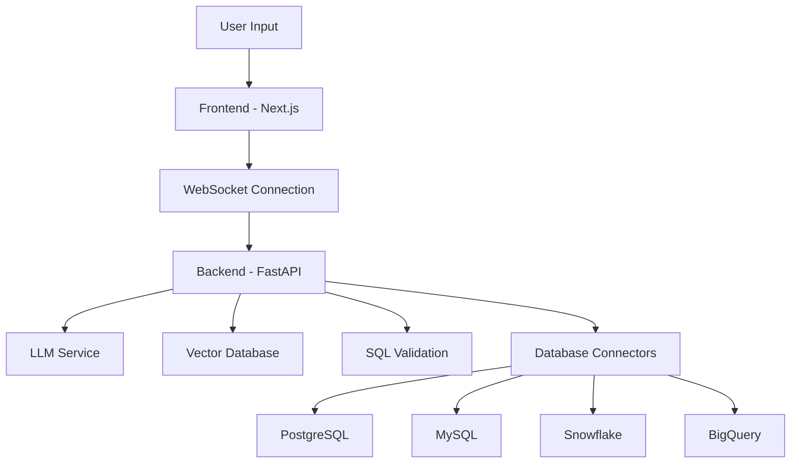

## What is SamvadQL?

SamvadQL provides an intuitive, AI-driven experience for data access and interaction. It bridges the gap between natural language and SQL, making database querying accessible to users regardless of their SQL expertise.

## Key Features

<CardGroup cols={2}>
  <Card
    title="Natural Language Processing"
    icon="brain"
    href="/features/text-to-sql"
  >
    Convert natural language questions into SQL queries using advanced Large
    Language Models (LLMs).
  </Card>
  <Card title="Real-time Streaming" icon="bolt" href="/features/streaming">
    Progressive query generation with live explanations as the AI processes your
    request.
  </Card>
  <Card
    title="Intelligent Schema Selection"
    icon="bullseye"
    href="/features/schema-selection"
  >
    Automatic table and column recommendation using vector search technology.
  </Card>
  <Card
    title="Multi-Database Support"
    icon="database"
    href="/features/multi-database"
  >
    Works with PostgreSQL, MySQL, Snowflake, and BigQuery out of the box.
  </Card>
</CardGroup>

## Architecture Overview

## Target Users

<AccordionGroup>
  <Accordion title="Data Analysts">
    Business users who need SQL access without deep SQL knowledge
  </Accordion>
  <Accordion title="Database Administrators">
    Managing query access and governance across teams
  </Accordion>
  <Accordion title="Developers">
    Building data-driven applications with natural language interfaces
  </Accordion>
</AccordionGroup>

## Getting Started

Ready to dive in? Check out our installation guide to get SamvadQL running locally.

<CardGroup cols={2}>
  <Card title="Quick Start" icon="play" href="/quickstart">
    Get up and running in 5 minutes
  </Card>
  <Card title="Installation" icon="download" href="/installation">
    Complete installation guide
  </Card>
</CardGroup>

## Technology Stack

<Tabs>
  <Tab title="Backend">
    - **Framework**: FastAPI with Python 3.11+ - **Database**: PostgreSQL,
    SQLAlchemy 2.0+ - **AI/ML**: LangChain with OpenAI/Anthropic - **Cache**:
    Redis for performance
  </Tab>
  <Tab title="Frontend">
    - **Framework**: Next.js 14+ with React 18+ - **Language**: TypeScript with
    strict mode - **Styling**: Tailwind CSS with shadcn/ui - **State**: Redux
    Toolkit
  </Tab>
  <Tab title="Infrastructure">
    - **Containers**: Docker with multi-stage builds - **Vector DB**:
    Qdrant/OpenSearch - **Jobs**: Celery with Redis broker - **Monitoring**:
    Built-in audit logging
  </Tab>
</Tabs>

## Support

<CardGroup cols={3}>
  <Card title="Documentation" icon="book-open" href="/quickstart">
    Comprehensive guides and tutorials
  </Card>
  <Card
    title="GitHub Issues"
    icon="github"
    href="https://github.com/your-org/samvadql/issues"
  >
    Report bugs and request features
  </Card>
  <Card
    title="Community"
    icon="users"
    href="https://github.com/your-org/samvadql/discussions"
  >
    Join our community discussions
  </Card>
</CardGroup>
